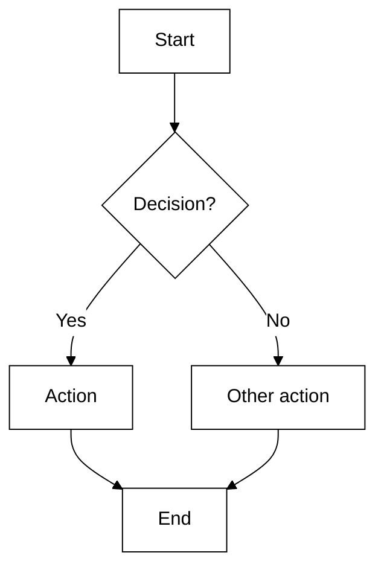
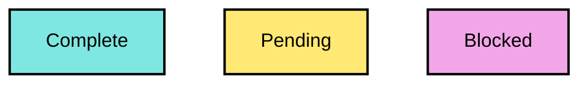

# Accessible Mermaid diagrams — SERIO

**A diagram is only Section 508 compliant if it reads with enough contrast, doesn't depend on color to
carry meaning, and has a text alternative in the prose.** This repo already uses mermaid in
[`docs/SERIO-APP-WALKTHROUGH.md`](../../docs/SERIO-APP-WALKTHROUGH.md) and
[`../../SERIO-SZR-MEMO-WORKFLOW.md`](../../SERIO-SZR-MEMO-WORKFLOW.md) — match this when you add more.

> Siblings: [`section-508-color-palette`](../section-508-color-palette/SKILL.md) (the color rule this
> applies), [`section-508-compliance`](../section-508-compliance/SKILL.md) (the full checklist).

---

## Quick reference

**Use when:** adding/editing a mermaid diagram in a SERIO doc.
**Three musts:** (1) fills behind **black text** with **solid 2px borders**; (2) tell states apart by
**label/shape, not just hue** — never red-vs-green; (3) write a **one-line text summary** next to the
diagram so a non-visual reader gets the same information.

---

## Accessible theme block

Put this at the top of the diagram. It uses high-contrast neutrals with black text and solid borders —
readable and grayscale-safe.

## Coding states with color (the repo's cyan/yellow/magenta)

When you *do* color nodes by state, use this repo's signal colors as **fills behind black text**, keep
the **solid border**, and keep the **word in the label** so the meaning survives without color. Never
distinguish two states by red vs. green alone.

- `ok` = cyan, `caution` = yellow, `attn` = magenta — **each fill sits behind black text** so it clears
  the 4.5:1 contrast floor, and **each node names its state** so color is never the only signal.
- Keep `stroke-width:2px` and a near-black stroke so shapes stay visible in grayscale / for low vision.

## The text alternative (do not skip)

Every diagram needs a sentence or two right beside it that states what it shows, e.g.:

> *Figure: the SZR memo flow — a Compliance Officer triggers generation on the CB SZR screen, SERIO+
> builds the PDF server-side, stores it in DRMS, and the work item moves SZR → SZP.*

That summary is what a screen-reader user (and anyone skimming) actually gets — mermaid renders to an
image with no reliable alt text of its own.

---

## Checklist

- [ ] Fills behind black text; solid borders ≥ 2px
- [ ] States differ by label/shape too — never red-vs-green alone
- [ ] Signal colors are cyan / yellow / magenta, each behind dark text
- [ ] Readable in grayscale
- [ ] One-line text summary in the surrounding prose
